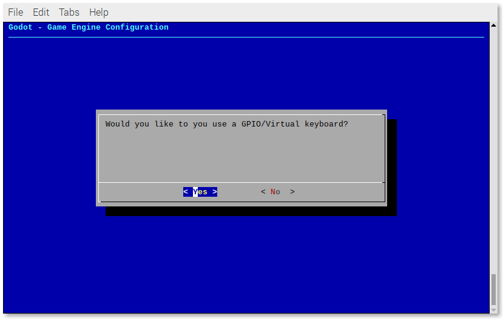
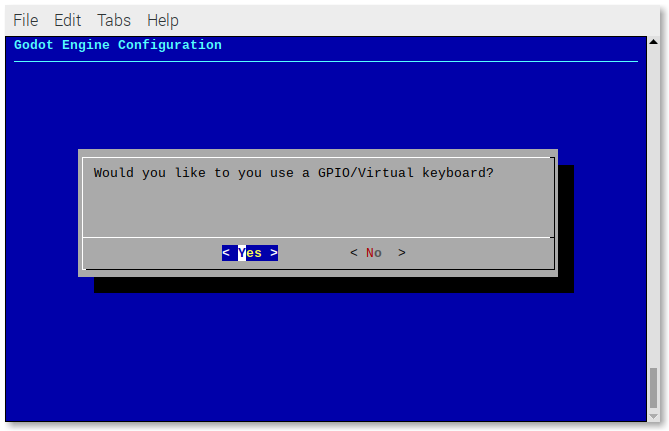
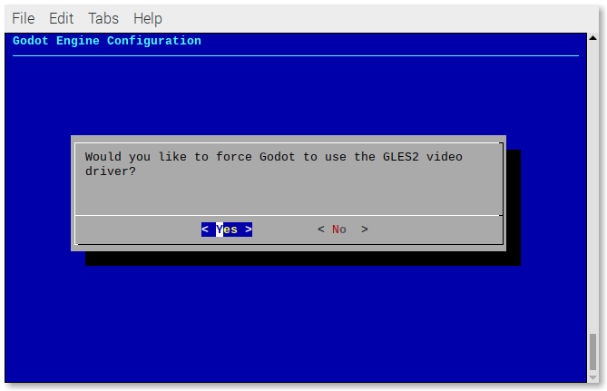
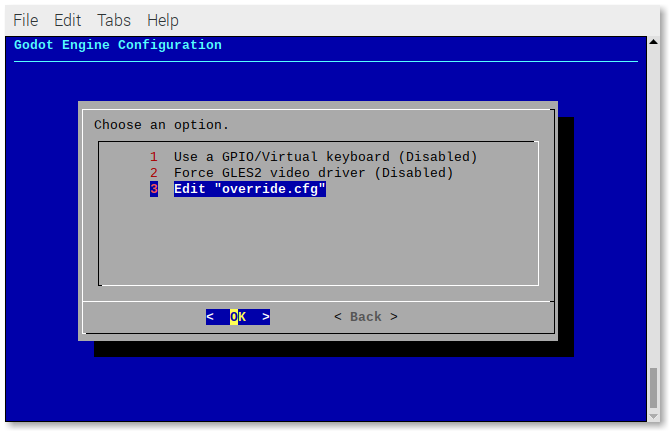
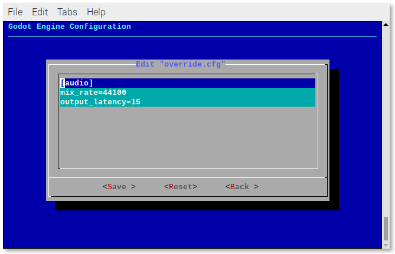
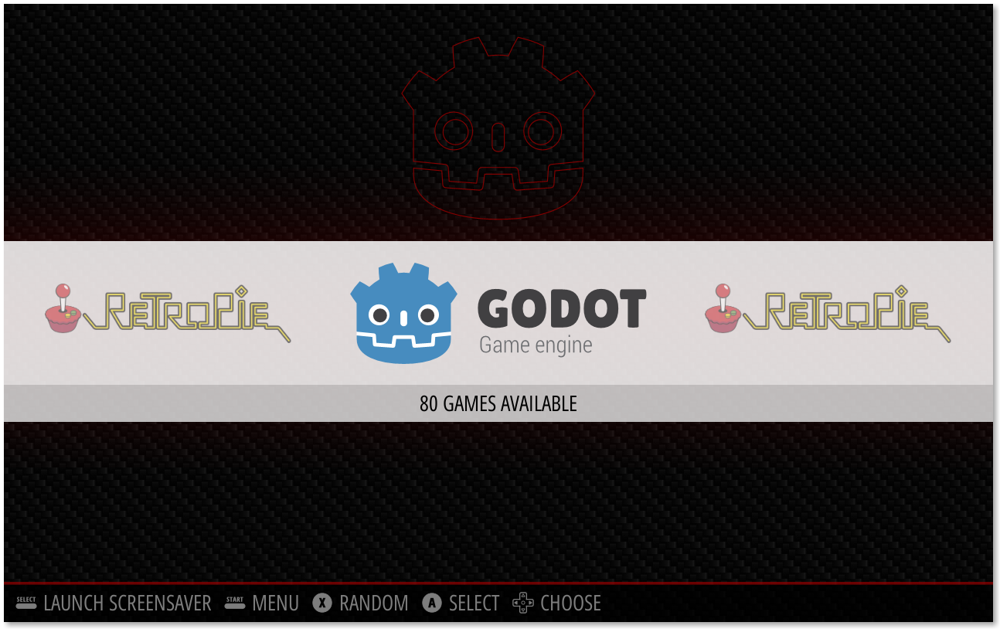
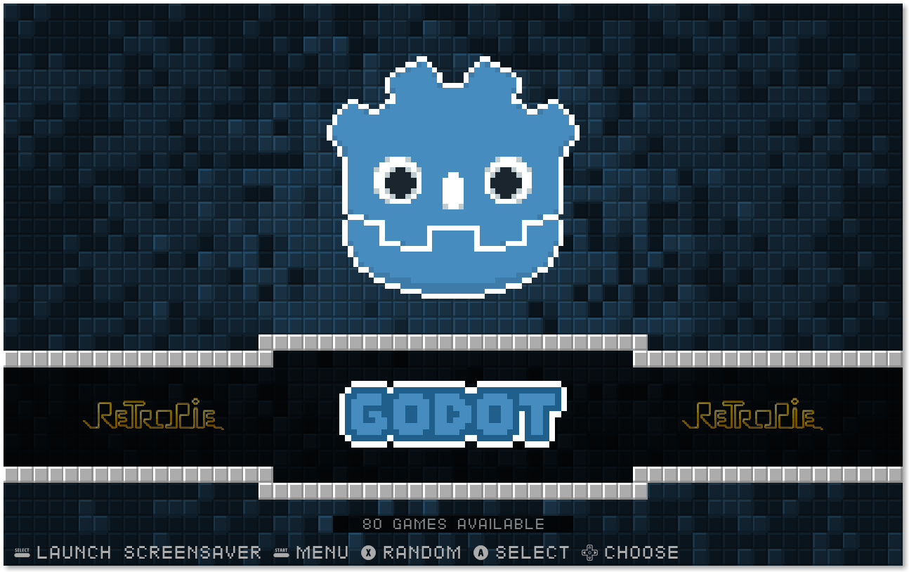

# RetroPie Godot Engine "Emulator"

 

A scriptmodule to install a Godot "emulator" for RetroPie.

Thanks to [@efornara](https://github.com/efornara) (for creating [FRT - A Godot "platform" targeting single board computers](https://github.com/efornara/frt)) you can now play 2D games made with the [Godot Engine](https://godotengine.org/) on the Raspberry Pi (and other single-board computers) using [RetroPie](https://retropie.org.uk/).

If you are running RetroPie on an `x86/x86_64` Linux PC you can also play Godot games, since the Godot "emulator" is actually the official **Linux/X11** export template.

## Table of contents

- [Where to find games made with Godot](#-where-to-find-games-made-with-godot)
- [Compatibility list](#%EF%B8%8F-compatibility-list)
- [Setup script](#%EF%B8%8F-setup-script)
- [Install the Godot "emulator" from RetroPie-Setup](#install-the-godot-emulator-from-retropie-setup)
- [Uninstall the Godot "emulator" from RetroPie-Setup](#uninstall-the-godot-emulator-from-retropie-setup)
- [Update the Godot "emulator" from RetroPie-Setup](#update-the-godot-emulator-from-retropie-setup)
- [How to install Godot games](#how-to-install-godot-games)
- [Using a GPIO/Virtual keyboard](#using-a-gpiovirtual-keyboard)
- [Troubleshooting](#ℹ%EF%B8%8F-troubleshooting)
- [How to create a new Godot system for an EmulationStation theme](#-how-to-create-a-new-godot-system-for-an-emulationstation-theme)
- [Pre-made Godot systems](#-pre-made-godot-systems)

## 🎮 Where to find games made with Godot

There are plenty of games made with Godot, most of them hosted on https://itch.io.

You can find Godot games using the following links:

- https://itch.io/games/made-with-godot
- https://itch.io/games/tag-godot

Most games are free to dowload, some are "pay what you want" with a suggested price (including free) and a few are paid. If you like the game, consider supporting the authors 😊.

## ✔️ Compatibility list

Take a look at the [compatibility list](https://docs.google.com/spreadsheets/d/1ybU_NHqhnJmZnlP9YDDGEf4BJ5nInbfsVVQtQCM7rYw/edit?usp=sharing) to check which games work.

Everyone can contribute to the list by starting a [discussion](https://github.com/hiulit/RetroPie-Godot-Game-Engine-Emulator/discussions).

## 🛠️ Setup script

### Install the script

```
cd /home/pi/
git clone https://github.com/hiulit/RetroPie-Godot-Game-Engine-Emulator.git
cd RetroPie-Godot-Game-Engine-Emulator/
sudo chmod +x setup-godot-engine-scriptmodule.sh
```

### Update the script

```
cd RetroPie-Godot-Game-Engine-Emulator/
git pull
```

## 🚀 Usage

```
./setup-godot-engine-scriptmodule.sh [OPTIONS]
```

If no options are passed, you will be prompted with a usage example:

```
USAGE: ./setup-godot-engine-scriptmodule.sh [OPTIONS]

Use '--help' to see all the options.
```

The script assumes that you are running it on a Raspberry Pi with the `RetroPie-Setup` folder being stored in `/home/pi/RetroPie-Setup`. If your setup differs, you can pass the path where your `RetroPie-Setup` folder is stored as a parameter, like this:

```
./setup-godot-engine-scriptmodule.sh [OPTION] "/path/to/your/RetroPie-Setup"
```

## 📖 Options

- `--help`: Prints the help message and exit.
- `--version`: Shows the script version.
- `--install [path]`: Installs the scriptmodule.
  - Path: The location of the `RetroPie-Setup` folder.
  - Default: `/home/pi/RetroPie-Setup`.
- `--uninstall [path]`: Uninstalls the scriptmodule.
  - Path: The location of the `RetroPie-Setup` folder.
  - Default: `/home/pi/RetroPie-Setup`.
- `--update [path]`: Updates the scriptmodule.
  - Path: The location of the `RetroPie-Setup` folder.
  - Default: `/home/pi/RetroPie-Setup`.

## Install the Godot "emulator" from RetroPie-Setup

Once you've successfully installed the scriptmodule, run:

```
sudo /home/pi/RetroPie-Setup/retropie_setup.sh
```

Go to:

- Manage packages
- Manage optional packages
- godot-engine
- Install from source

The script installs all the major versions of Godot for maximum compatibility:

- `2.1.6`
- `3.0.6`
- `3.1.2`
- `3.2.3`

A new `godot-engine` folder will be created in `/home/pi/RetroPie/roms/`, where you can [install the Godot games](#how-to-install-godot-games) using the `.pck` and `.zip` extensions.

## Uninstall the Godot "emulator" from RetroPie-Setup

Run:

```
sudo /home/pi/RetroPie-Setup/retropie_setup.sh
```

Go to:

- Manage packages
- Manage optional packages
- godot-engine
- Remove

## Update the Godot "emulator" from RetroPie-Setup

> Before updating the "emulator", you must update the **setup script** and the **scriptmodule**.

Run:

```
sudo /home/pi/RetroPie-Setup/retropie_setup.sh
```

Go to:

- Manage packages
- Manage optional packages
- godot-engine
- Update from source

## How to install Godot games

When you download a game from https://itch.io, the downloaded `.zip` usually contains 2 files:

- The Godot executable.
- The game data.

The later is, most of the times, a `.pck` file. That's the one we want!

Those `.pck` files will most likely be found on the **Linux downloads** (maybe on the **Windows downloads** too).

If you can't find a `.pck` file on neither the Linux nor the Windows downloads, you can try the **Mac/OSX downloads**. You'll have to:

- Unzip the `.zip` file.
- Go to `Contents -> Resources` (the `.pck` file should be in this folder).

To install it, just copy the `.pck` file to `/home/pi/RetroPie/roms/godot-engine`.

## Using a GPIO/Virtual keyboard

**Warning! When using a GPIO/Virtual keyboard, the actual keyboard won't work anymore. But you can always remove the GPIO/Virtual keyboard (see below).**

As of **v1.2.0**, when using the **FRT** "emulator", you can use a GPIO/Virtual keyboard, such as [GPIOnext](https://github.com/mholgatem/GPIOnext) or [Adafruit's Retrogame](https://github.com/adafruit/Adafruit-Retrogame).

### Add/Remove a GPIO/Virtual keyboard

Run:

```
sudo /home/pi/RetroPie-Setup/retropie_setup.sh
```

and then go to:

- Configuration/tools
- godot-engine

Select **Use a GPIO/Virtual keyboard**.



Select **Yes**.



You will be prompted with a menu showing all the results from the command `cat /proc/bus/input/devices`. Select the GPIO/Virtual keyboard that you want.

If you want to to reverse that action, follow the same steps and select **No**.
 
## ℹ️ Troubleshooting

### A game doesn't launch or crashes

> Useful information about errors can be found at `/dev/shm/runcommand.log`.

If the game you are trying to play doesn't work, it will most likely be because it was made with another version of Godot. Try changing the Godot "emulator" version in the [runcommand](https://github.com/RetroPie/RetroPie-Setup/wiki/runcommand).

If you downloaded the game from https://itch.io, there's a good chance the author stated which version of Godot that game uses.

In case none of the "emulators" work... **Sorry 😔**.

Well... there's **one last thing** you could try. See the section below.

### Force Godot to use the GLES2 video render

If you get this error when trying to play a game:

> Your video card driver does not support any of the supported OpenGL versions. Please update your drivers or if you have a very old or integrated GPU upgrade it.

You can force the Godot "emulator" to use the GLES2 video driver.

Run:

```
sudo /home/pi/RetroPie-Setup/retropie_setup.sh
```

Go to:

- Configuration/tools
- godot-engine

Select **Force GLES2 video driver**.



Select **Yes**.


If you want to to reverse that action, follow the same steps and select **No**.

### Audio issues

If you find that the sound is glitchy, you can try to fix it by changing some values in the `override.cfg` file.

Run:

```
sudo /home/pi/RetroPie-Setup/retropie_setup.sh
```

Go to:

- Configuration/tools
- godot-engine

Select **Edit "override.cfg"**.



Under the `[audio]` section, set:

- `mix_rate` to `48000`.
- `output_latency` to `20` (or `30`).



## 🎨 How to create a new Godot system for an EmulationStation theme

As there is no way to create a script to automate this, because themes don't have the same structure, the best way is to manually create a new system in your preferred theme.

- [Download](https://raw.githubusercontent.com/hiulit/RetroPie-Godot-Game-Engine-Emulator/master/art/system.svg) the Godot `system.svg`.
- [Download](https://raw.githubusercontent.com/hiulit/RetroPie-Godot-Game-Engine-Emulator/master/art/controller.svg) the Godot `controller.svg`.
- Copy any system folder in your theme (e.g. `/etc/emulationstation/themes/[THEME]/nes`).
- Rename it as `godot-engine`.
- Move the Godot `system.svg` and `controller.svg` to the `godot-engine/art` folder.

**NOTE**:

The folder structure in the theme you are using might differ. Take a look at how this particular theme works to create the `godot-engine` folder accordingly. You might need to delete extra icons that are not needed.

## 🤖 Pre-made Godot systems

I've created a couple of ready-to-use Godot systems:

- For the **Carbon theme**, which is the default EmulationStation theme that comes with RetroPie.
- For the **Pixel theme**, my personal favourite theme.

If you want to add a new theme, feel free to open a [pull request](https://github.com/hiulit/cross-compile-godot-raspberry-pi/pulls).

To install a Godot system, copy the `theme/[THEME]/godot-engine` folder from this repository to `/etc/emulationstation/themes/[THEME]`.

### Carbon theme



### Pixel theme



## 🗒️ Changelog

See [CHANGELOG](/CHANGELOG.md).

## 👤 Author

**hiulit**

- Twitter: [@hiulit](https://twitter.com/hiulit)
- GitHub: [@hiulit](https://github.com/hiulit)

## 🤝 Contributing

Feel free to:

- [Open an issue](https://github.com/hiulit/cross-compile-godot-raspberry-pi/issues) if you find a bug.
- [Create a pull request](https://github.com/hiulit/cross-compile-godot-raspberry-pi/pulls) if you have a new cool feature to add to the project.
- [Start a new discussion](https://github.com/hiulit/cross-compile-godot-raspberry-pi/discussions) about a feature request.

## 🙌 Supporting this project

If you love this project or find it helpful, please consider supporting it through any size donations to help make it better ❤️.

[](https://www.patreon.com/hiulit)

[](https://ko-fi.com/F2F7136ND)

[](https://www.buymeacoffee.com/hiulit)

[](https://www.paypal.com/paypalme/hiulit)

If you can't, consider sharing it with the world...

[](https://twitter.com/intent/tweet?url=https%3A%2F%2Fgithub.com%2Fhiulit%2Fcross-compile-godot-raspberry-pi&text=Cross-compile+Godot+binaries+for+the+Raspberry+Pi%3A%0D%0AA+script+to+easily+cross-compile+Godot+binaries+for+the+Raspberry+Pi+from+Linux+x86_64+by+%40hiulit)

... or giving it a [star ⭐️](https://github.com/hiulit/cross-compile-godot-raspberry-pi/stargazers).

## 👏 Credits

Thanks to:

- **Juan Linietsky** ([@reduz](https://github.com/reduz)), **Ariel Manzur** ([@punto-](https://github.com/punto-)), **Rémi Verschelde** ([@akien-mga](https://github.com/akien-mga)) and **all the Godot contributors** - For creating and maintaining the [Godot Engine](https://github.com/godotengine/godot).
- **Emanuele Fornara** ([@efornara](https://github.com/efornara)) - For creating [FRT - A Godot "platform" targeting single board computers](https://github.com/efornara/frt).
- **Andrea Calabró** - For creating the "Godot logo". Changes made to it:
  - Created an outline version.
- **Alícia Folgarona Ribot** ([@pingudroid](https://twitter.com/pingudroid)) - For creating the "Pixel Godot logo". Changes made to it:
  - New colors.
  - Added white outline.

## 📝 Licenses

- Source code: [MIT License](/LICENSE).
- Godot Engine: [MIT License](/LICENSE_GODOT.txt).
- FRT - A Godot platform targeting single board computers: [MIT License](/LICENSE_FRT.txt).
- Godot logo: [CC BY](https://creativecommons.org/licenses/by/4.0/).
- Pixel Godot logo: [CC BY-NC-SA](https://creativecommons.org/licenses/by-nc-sa/4.0/).
