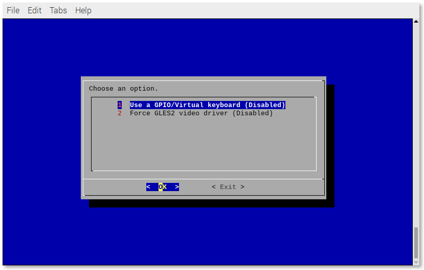
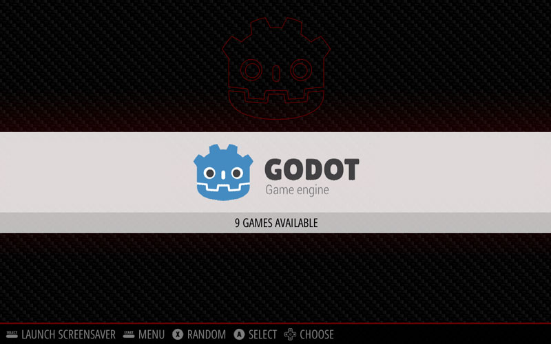
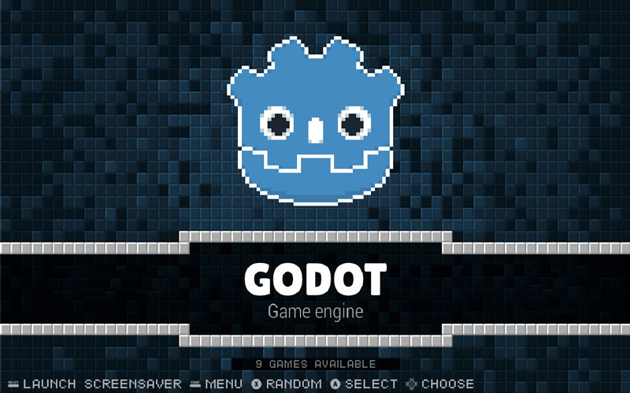

# RetroPie Godot Game Engine "Emulator" 

A scriptmodule to install a Godot "emulator" for RetroPie.

Thanks to [@efornara](https://github.com/efornara) (for creating [FRT - A Godot "platform" targeting single board computers](https://github.com/efornara/frt)) you can now **play\*** games made with [Godot](https://godotengine.org/) on the Raspberry Pi (and other single-board computers) using [RetroPie](https://retropie.org.uk/).

**\*Games that (would) work on a Raspberry Pi must have been created with Godot version >= 3.1.x using GLES2 (or Godot 2.x.x) and they must not use any "fancy VFX", like particles, heavy shaders and other CPU/GPU demanding stuff and should preferably be 2D.**

If you are running RetroPie on an `x86` Linux PC, the Godot "emulator" uses the **Linux/X11-32bits** export template instead of **FRT**, so most games should work fine.

## Where to find games made with Godot

There are plenty of games made with Godot, most of them hosted on https://itch.io.

You can find Godot games using the following links:

- https://itch.io/games/made-with-godot
- https://itch.io/games/tag-godot

Most games are free to dowload, some are "pay what you want" with a suggested price and a few are paid. If you like the game, consider supporting the authors 😊.

**NOTE**:

When you download a game from https://itch.io, you have to look for a `.pck` file to be able to play the game using the Godot "emulator". Those files will most likely be found on **Linux downloads** (maybe on **Windows downloads**
 too).

If you can't find a `.pck` file on neither the Linux nor the Windows downloads, you can try the **Mac/OSX downloads**. You'll have to:

- Unzip the `.zip` file.
- Go to `Contents -> Resources` and in this folder there sould be the `.pck` file.

## Compatibility list

Take a look at the [compatibility list](https://docs.google.com/spreadsheets/d/1ybU_NHqhnJmZnlP9YDDGEf4BJ5nInbfsVVQtQCM7rYw/edit?usp=sharing) to check which games work. Everyone can contribute to the list.

## Install the setup script

```
cd /home/pi/
git clone https://github.com/hiulit/RetroPie-Godot-Game-Engine-Emulator.git
cd RetroPie-Godot-Game-Engine-Emulator/
sudo chmod +x setup-godot-engine-scriptmodule.sh
```

## Update the setup script

```
cd RetroPie-Godot-Game-Engine-Emulator/
git pull
```

## Usage

```
./setup-godot-engine-scriptmodule.sh [OPTIONS]
```

If no options are passed, you will be prompted with a usage example:

```
USAGE: ./setup-godot-engine-scriptmodule.sh [OPTIONS]

Use '--help' to see all the options.
```

The script assumes that you are running it on a Raspberry Pi with the `RetroPie-Setup` folder being stored in `/home/pi/RetroPie-Setup`. If your setup differs, you can pass the path where your `RetroPie-Setup` folder is stored as a parameter, like this:

```
./setup-godot-engine-scriptmodule.sh [OPTION] "/path/to/your/RetroPie-Setup"
```
## Options

- `--help`: Print the help message and exit.
- `--install`: Install the scriptmodule.
- `--uninstall`: Uninstall the scriptmodule.
- `--update`: Update the scriptmodule.
- `--version`: Show the script's version.

## Examples

### `--help`

Print the help message and exit.

#### Example

`./setup-godot-engine-scriptmodule.sh --help`

### `--install`

Install the scriptmodule.

#### Example

`./setup-godot-engine-scriptmodule.sh --install`

### `--uninstall`

Uninstall the scriptmodule.

#### Example

`./setup-godot-engine-scriptmodule.sh --uninstall`

### `--update`

Update the scriptmodule.

#### Example

`./setup-godot-engine-scriptmodule.sh --update`

### `--version`

Show the script's version.

#### Example

`./setup-godot-engine-scriptmodule.sh --version`

## Install the Godot "emulator" from RetroPie-Setup

Once you've [successfully installed](#--install) the scriptmodule, run:

```
sudo /home/pi/RetroPie-Setup/retropie_setup.sh
```

and then go to:

- Manage packages
- Manage optional packages
- godot-engine
- Install from source

A new `godot-engine` folder will be created in `/home/pi/RetroPie/roms/`, where you can put your games using the `.pck` and `.zip` extensions.

For example, if you download a game from https://itch.io/, the downloaded `.zip` usually contains 2 files: the executable and the game. The later is, most of the times, a `.pck` file. That's the one we want. Just copy it to `/home/pi/RetroPie/roms/godot-engine`.

The script installs different versions of the "emulator" for maximum compatibility:

- `2.1.6`
- `3.0.6`
- `3.1.2`
- `3.2.3`

If you are using an `x86` PC, the "emulators" used are Godot's export templates downloaded from https://godotengine.org/download/.

- `godot-engine-x.x.x-x86`

For the Raspberry Pi, the script will auto-detect if you are using a `0/1`, a `2/3` or a `4` version and it will install the proper **FRT** "emulators".

- `godot-engine-x.x.x-frt-rpi0-1`
- `godot-engine-x.x.x-frt-rpi2-3`
- `godot-engine-x.x.x-frt-rpi4`

In the case of the **Raspberry Pi 4**, the script will install additional Godot "emulators" specifically compiled for it.

- `godot-engine-x.x.x-rpi4`

For any `arm64` single-board computer, the script will install the proper **FRT** "emulators".

- `godot-engine-x.x.x-frt-arm64`

## Uninstall the Godot "emulator" from RetroPie-Setup

Run:

```
sudo /home/pi/RetroPie-Setup/retropie_setup.sh
```

and then go to:

- Manage packages
- Manage optional packages
- godot-engine
- Remove

## Update the Godot "emulator" from RetroPie-Setup

Run:

```
sudo /home/pi/RetroPie-Setup/retropie_setup.sh
```

and then go to:

- Manage packages
- Manage optional packages
- godot-engine
- Update from source

## Using a GPIO/Virtual keyboard

**Warning! When using a GPIO/Virtual keyboard, the actual keyboard won't work anymore. But you can always remove the GPIO/Virtual keyboard (see below).**

As of **v1.2.0**, when using the **FRT** emulator, you can use a GPIO/Virtual keyboard, such as [GPIOnext](https://github.com/mholgatem/GPIOnext) or [Adafruit's Retrogame](https://github.com/adafruit/Adafruit-Retrogame).

### Add/Remove a GPIO/Virtual keyboard

Run:

```
sudo /home/pi/RetroPie-Setup/retropie_setup.sh
```

and then go to:

- Configuration/tools
- godot-engine

Select **Use a GPIO/Virtual keyboard**.



Select **Yes**.


You will be prompted with a menu showing all the results from the command `cat /proc/bus/input/devices`. Select the GPIO/Virtual keyboard that you want.

If you want to to reverse that action, follow the same steps and select **No**.

 
## Troubleshooting

### A game doesn't launch or crashes

If the game you are trying to play doesn't work, it will most likely be because it was made with another version of Godot.

Try changing the Godot "emulator" version in the [runcommand](https://github.com/RetroPie/RetroPie-Setup/wiki/runcommand).

If you downloaded the game from https://itch.io, there a good chance the author has stated which version of Godot that game uses.

In case none of the "emulators" work... **Sorry 😔**.

Well... there's **one last thing** you could try. See the section below.

### Force Godot to use the GLES2 video render

If you get this error when trying to play a game:

> Your video card driver does not support any of the supported OpenGL versions. Please update your drivers or if you have a very old or integrated GPU upgrade it.

You can force the Godot "emulator" to use the GLES2 video driver.

Run:

```
sudo /home/pi/RetroPie-Setup/retropie_setup.sh
```

and then go to:

- Configuration/tools
- godot-engine

Select **Force GLES2 video driver**.


Select **Yes**.


If you want to to reverse that action, follow the same steps and select **No**.


## How to create a new Godot system for an EmulationStation theme

As there is no way to create a script to automate this, because themes don't have the same structure, the best way is to manually create a new system in your preferred theme.

- [Download](https://raw.githubusercontent.com/hiulit/RetroPie-Godot-Game-Engine-Emulator/master/art/system.svg) the Godot `system.svg`.
- [Download](https://raw.githubusercontent.com/hiulit/RetroPie-Godot-Game-Engine-Emulator/master/art/controller.svg) the Godot `controller.svg`.
- Copy any system folder in your theme (e.g. `/etc/emulationstation/themes/[THEME]/nes`).
- Rename it as `godot-engine`.
- Move the Godot `system.svg` and `controller.svg` to the `godot-engine/art` folder.

**NOTE**:

The folder structure in the theme you are using might differ. Take a look at how this particular theme works to create the `godot-engine` folder accordingly. You might need to delete extra icons that are not needed.

## Premade Godot systems

I've created a couple of ready-to-use Godot systems.

One for the default EmulationStation theme that comes in RetroPie, **Carbon theme**, and the other, my personal favourite theme, for the **Pixel theme**.

Copy the `theme/[THEME]/godot-engine` folder from this repository to `/etc/emulationstation/themes/[THEME]`.

### Carbon theme



### Pixel theme



## Changelog

See [CHANGELOG](/CHANGELOG.md).

## Author

Me 😛 [@hiulit](https://github.com/hiulit).

## Credits

Thanks to:

- Emanuele Fornara [@efornara](https://github.com/efornara) - For creating [FRT - A Godot "platform" targeting single board computers](https://github.com/efornara/frt).
- Andrea Calabró - For creating the **Godot logo**. Changes made to it:
  - Created an outline version.
- Alícia Folgarona Ribot (Alfórium Studios) [@alforiumstudios](https://twitter.com/alforiumstudios) - For creating the **Pixel Godot logo**. Changes made to it:
  - New colors.
  - Added white outline.

## LICENSE

- Source code: [MIT License](/LICENSE).
- Godot logo: [CC BY](https://creativecommons.org/licenses/by/3.0/).
- Pixel Godot logo: [CC BY-NC-SA](https://creativecommons.org/licenses/by-nc-sa/4.0/).
- Godot - Game Engine: [MIT License](/LICENSE_GODOT).
- FRT - A Godot platform targeting single board computers: [MIT License](/LICENSE_FRT).
