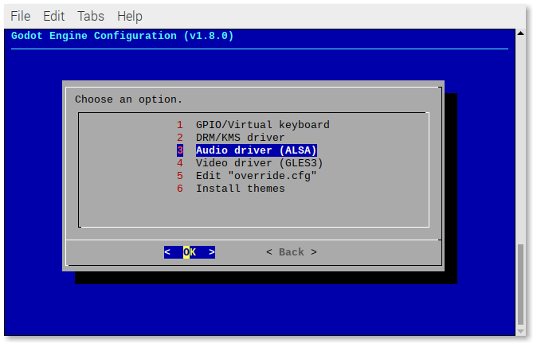
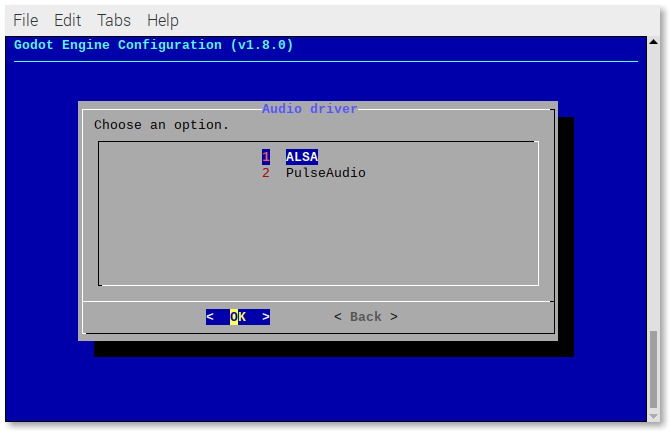

# AUDIO ISSUES

## Audio driver

If you don't have sound or have sound errors, you can try force Godot to use another audio driver.

Run:

```
sudo ~/RetroPie-Setup/retropie_setup.sh
```

Go to:

- Configuration/tools
- godot-engine

Select **Audio driver**.



Select **PulseAudio**.



If you want to to reverse that action, follow the same steps and select **ALSA**.

## Sound glitches

If you find that the sound is glitchy, you can try to fix it by changing some values in the `override.cfg` file.

Run:

```
sudo ~/RetroPie-Setup/retropie_setup.sh
```

Go to:

- Configuration/tools
- godot-engine

Select **Edit "override.cfg"**.


Under the `[audio]` section, set:

- `mix_rate` to `48000`.
- `output_latency` to `20` (or `30`).


You can also modify this file manually at `~/RetroPie/roms/godot-engine/override.cfg`.