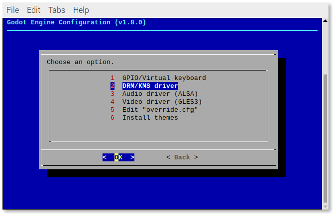
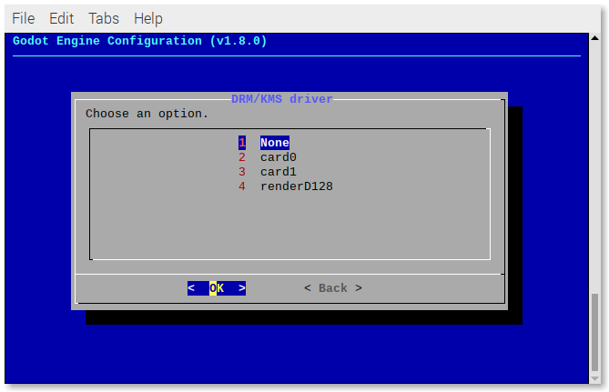
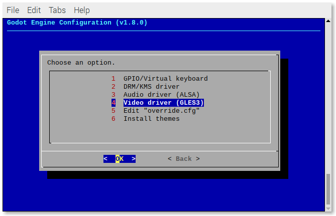
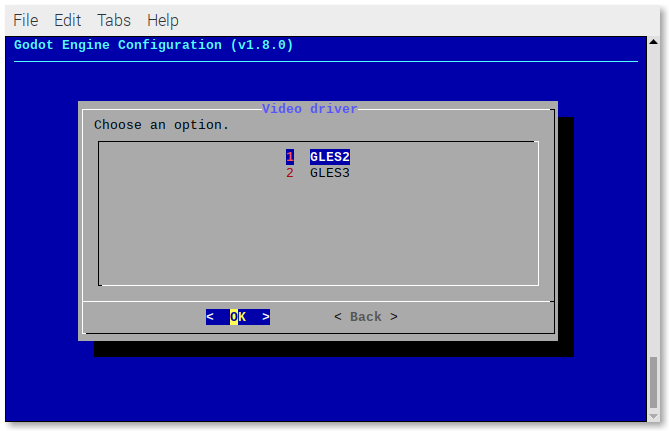

# VIDEO ISSUES

## DRM/KMS driver

If you get this error when trying to play a game:

> frt: failed to get resources.

Run:

```
sudo ~/RetroPie-Setup/retropie_setup.sh
```

Go to:

- Configuration/tools
- godot-engine

Select **DRM/KMS driver**.



Select the driver.



If you want to to reverse that action, follow the same steps and select **None**.

## Video driver

If you get this error when trying to play a game:

> Your video card driver does not support any of the supported OpenGL versions. Please update your drivers or if you have a very old or integrated GPU upgrade it.

You can try to force the Godot "emulator" to use the GLES2 video driver.

Run:

```
sudo ~/RetroPie-Setup/retropie_setup.sh
```

Go to:

- Configuration/tools
- godot-engine

Select **Video driver**.



Select **GLES2**.



If you want to to reverse that action, follow the same steps and select **GLES3**.